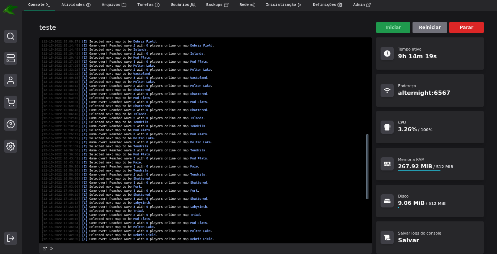
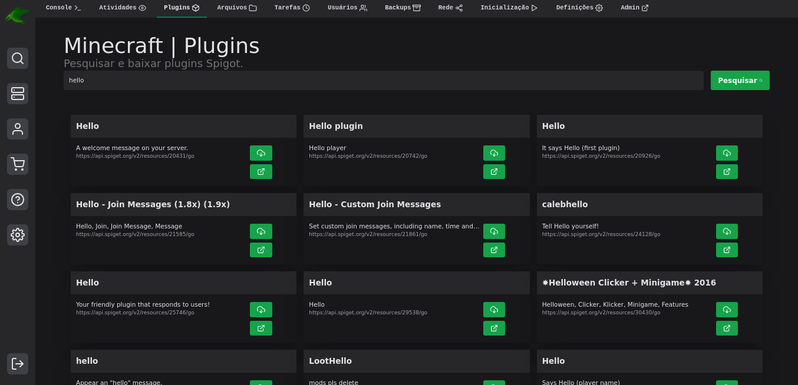
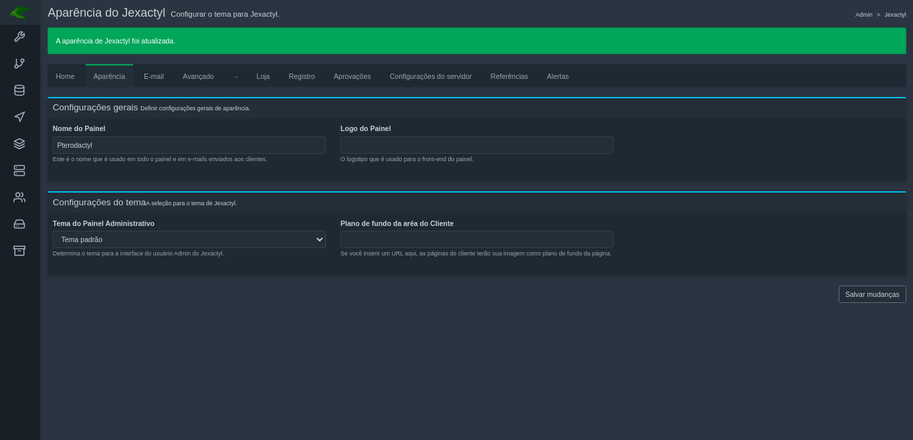
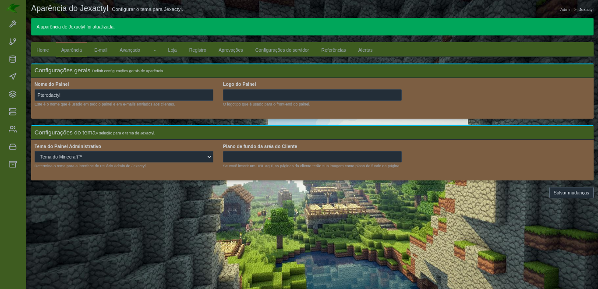
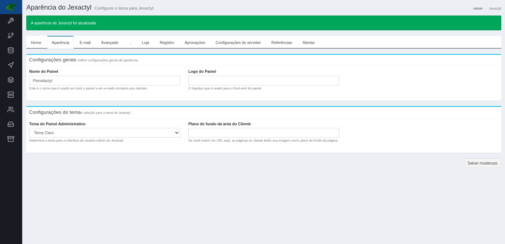
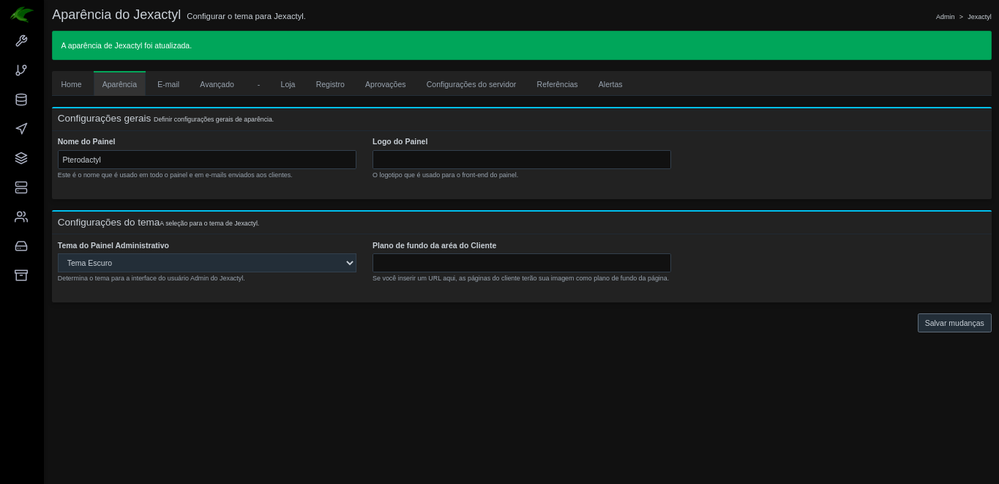
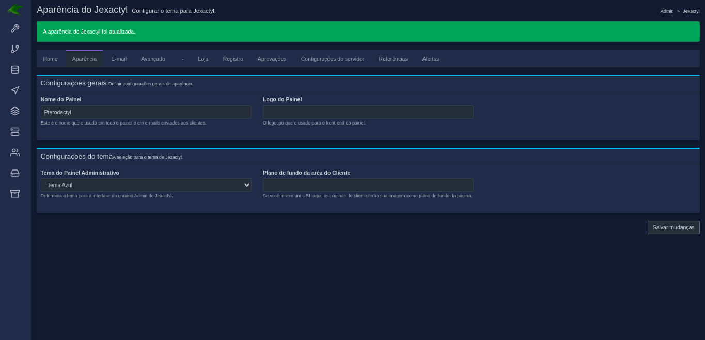

<h1 align="center">Jexactyl</h1>
<h5 align="center">
    <strong>
        Jexactyl é um painel de gerenciamento de jogos e sistema de faturamento rápido, avançado e personalizável em um só.
        Dê a seus usuários a vantagem em termos de desempenho, confiabilidade e pura funcionalidade.
    </strong>
</h5>

## Instalação
Vá até nossa [Documentação](https://docs.jexactylbrasil.ml/) para começar com a auto-hospedagem deste software.
Se você precisar de ajuda em algum momento durante o processo de instalação, por favor nos informe sobre [Discord](https://discord.gg/qttGR4Z5Pk).

## Por que usar Jexactyl?
* Sistema de faturamento que suporta [Stripe](https://stripe.com) e [PayPal](https://paypal.com) pronto para o uso.
* Total personalização através de um simples painel de controle administrativo.
* Sistema de tickets a fim de dar suporte aos clientes.
* Personalizabilidade e configurações aprimoradas.
* Uma UI/UX fluente com uma API fácil de usar tanto para administradores como para clientes.
* Aprovações de usuários, renovações de servidores, e muito mais.

## Patrocinadores
* Quer patrocinar a tradução do Jexactyl? [Doe aqui.](https://donate.stripe.com/6oE02Zftd9cC34IbIS)*

| Empresa | Sobre | Link |
| ------- | ----- | ------- |
| [**Nenhum patrocínio**](https://) | Descrição | [@ninguém](https://) |

## Previews

## Temas do Administrador

### Isenção de responsabilidade
* A Jexactyl Brasil não é de forma alguma afiliada ao [Jexactyl](https://jexactyl.com), somos um grupo de pessoas que decidirão trazer esse belo painel para a nossa língua (Portugues).
* De forma alguma a Jexactyl Brasil é afiliada de alguma forma ao [Pterodactyl®](https://pterdoactyl.io) ou ao [Jexactyl](https://jexactyl.com).

## Licensing
Some Javascript and CSS used within the panel are licensed under a `MIT` or `Apache 2.0` license. Please check their
respective header files for more information.

*Jexactyl is not affiliated with [Pterodactyl Software](https://pterodactyl.io).*
